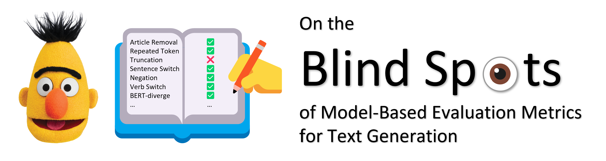

This is the Repo for the paper: [On the Blind Spots of Model-Based Evaluation Metrics for Text Generation](https://arxiv.org/abs/2212.10020)

We have code for three tasks, summarization, translation, and open-ended generation. For summarization or translation, please see [here](sum_mt/README.md). 

Our code and data for open-ended generation is [here](wiki/README.md). Note that the package dependency for open-ended generation is different (The metrics are different and the code is not shared), so you might need to create a seperate virtual environment.

One shortcoming of WMT data is they mostly contain only one sentence, therefore we build the TED-MT dataset. For information about how the **TED-MT** data is constructed, please refer to sum_mt/MT/ted_zhen/README.txt . 

The code for summarization or translation is developed based on the released code of [BARTScore](https://github.com/neulab/BARTScore/).

To appear at ACL 2023 (oral). If you find our work useful, please cite our paper, thanks!
```
@inproceedings{he-etal-2023-blind,
    title = "On the Blind Spots of Model-Based Evaluation Metrics for Text Generation",
    author = "He, Tianxing  and
      Zhang, Jingyu  and
      Wang, Tianle  and
      Kumar, Sachin  and
      Cho, Kyunghyun  and
      Glass, James  and
      Tsvetkov, Yulia",
    booktitle = "Proceedings of the 61st Annual Meeting of the Association for Computational Linguistics (Volume 1: Long Papers)",
    month = jul,
    year = "2023",
    address = "Toronto, Canada",
    publisher = "Association for Computational Linguistics",
    url = "https://aclanthology.org/2023.acl-long.674",
    pages = "12067--12097",
    abstract = "In this work, we explore a useful but often neglected methodology for robustness analysis of text generation evaluation metrics: stress tests with synthetic data. Basically, we design and synthesize a wide range of potential errors and check whether they result in a commensurate drop in the metric scores. We examine a range of recently proposed evaluation metrics based on pretrained language models, for the tasks of open-ended generation, translation, and summarization. Our experiments reveal interesting insensitivities, biases, or even loopholes in existing metrics. For example, we find that BERTScore is confused by truncation errors in summarization, and MAUVE (built on top of GPT-2) is insensitive to errors at the beginning or middle of generations. Further, we investigate the reasons behind these blind spots and suggest practical workarounds for a more reliable evaluation of text generation. We have released our code and data at https://github.com/cloudygoose/blindspot{\_}nlg.",
}
```
